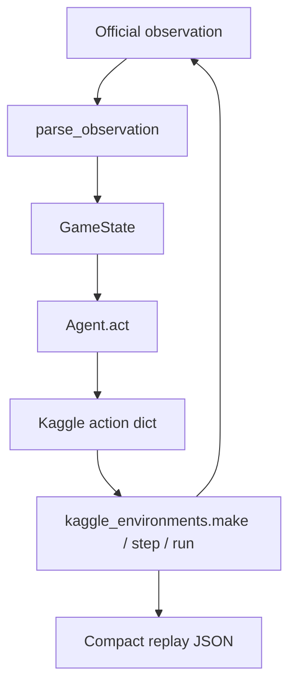

# Phase 0 + 1 + Minimum Phase 2 Foundation

The workspace at [`/home/smhase/Arena/Kaggriculture`](/home/smhase/Arena/Kaggriculture) is empty. There is no existing code to preserve. The official engine is [`kaggle_environments/envs/kaggriculture/kaggriculture.py`](https://github.com/Kaggle/kaggle-environments/blob/master/kaggle_environments/envs/kaggriculture/kaggriculture.py) (plus [`kaggriculture.json`](https://github.com/Kaggle/kaggle-environments/blob/master/kaggle_environments/envs/kaggriculture/kaggriculture.json)).

**Source of truth:** wrap `kaggle_environments.make("kaggriculture")`. Import constants (`CROPS`, `ANIMALS`, `PRODUCTS`, `MARKET_PARAMS`, `LAND_PRICES`, `SHOPS`, …) from the official module. Do not copy the interpreter.

Later-phase files will be **docstring-only stubs** (no fake APIs). Implementing economics, planner, UI, or ML is out of scope.

---

## What the official game actually is

Two players, separate 10×10 farms (four 5×5 quadrants, only NW unlocked). 24 turns/day × 30 days = 720 `episodeSteps`. Winner = **bank coins only**; unsold inventory is worth 0.

Each turn the agent returns:

```python
{"farmer": [op, ...args], "hands": [[op, ...], ...], "market": [[op, ...], ...]}
```

Unit ops are processed first (farmer + hands), then market orders (lockstep, max 10), then town consumption, plant decay, then end-of-day when `(step+1) % 24 == 0`.

**Illegal unit/market actions are silent no-ops.** The environment does not raise `INVALID` for planting on a weed, watering empty ground, etc. That is a contradiction with a typical “legal action space” design: our validator is for debugging/planning, not authority.

Key constants from source (not the competition markdown tables):

- Crops: wheat/carrot/tomato/strawberry/melon with seed costs 10/20/50/100/80
- Animals: goose/cow/sheep at 300/400/500; products egg/milk/wool
- Land: NE/SW/SE at $1000/$2000/$4000
- Hire: `fib(n)` with default mult 1, resets daily; hands vanish at EOD
- Market `I0=10000`, price floor $1; only `WHEAT` and `FERTILIZER` can be bought back
- `actTimeout=1s`, `remainingOverageTime=60`

Surprises to document (and verify with tests, not assume):

1. **`PICKUP` is `["PICKUP", item, n?]`** — competition/AGENTS.md text dropped the item argument. Source wins.
2. **`DROP` exists** (dump entire inventory to shed) even though some summaries omit it.
3. **Seeds never enter the shed**; `PLANT` consumes `private.seeds` directly. `SELL` only sells from the shed, not carried inventory.
4. **Hire/land happen after unit actions**, so a newly hired hand cannot act the same turn.
5. **Atomic PLANT:** if farmer+hands request more plants of a crop than seeds, *all* those PLANTs become PASS.
6. **New plants start `consecutive_unwatered=1`** — unwatered the same day they are planted, they weed that night. New animals start `consecutive_unfed=0`.
7. **Official `"random"` is unseeded** (`random.Random()` with no seed). Episode `seed` only drives weeds + shop unlocks. Do not use built-in random for reproducibility tests.
8. **Melon `max_yield_day=12` in `CROPS`**, but yield cap 6 is hit at age 10 with watering. The table’s “Time to Max Yield = 10” is the cap, not the code field.
9. **Episode length vs 720 acts** is slightly tricky (`DONE` when `step >= episodeSteps - 2`). First implementation task is to **measure** `len(env.steps)`, number of `act()` calls, final `day`/`hour`, and whether day-29 end-of-day refresh fires. Document the measured truth; do not guess.



---

## Structure (follow the requested layout, with small additions)

Keep the user’s tree. Add only:

- [`docs/game-mechanics.md`](docs/game-mechanics.md) — Phase 0 deliverable
- [`src/kaggriculture/__main__.py`](src/kaggriculture/__main__.py) — `python -m kaggriculture ...`
- [`src/kaggriculture/logging.py`](src/kaggriculture/logging.py) — one logger, levels ERROR/WARNING/INFO/DEBUG (TRACE as custom 5 if cheap)

**Implemented now**

- `src/kaggriculture/env/official_env.py` — wrapper
- `src/kaggriculture/env/observation.py` — parse raw obs → dataclasses
- `src/kaggriculture/env/state.py` — `GameState` / `PlayerState` / `MarketState` / `FarmState`
- `src/kaggriculture/env/actions.py` — action dict builders + `PASS` default
- `src/kaggriculture/env/rules.py` — re-export official constants; no duplicated formulas
- `src/kaggriculture/agents/base.py` — `Agent` protocol
- `src/kaggriculture/agents/random_agent.py` — seeded random **legal-ish** agent
- `src/kaggriculture/simulation/runner.py` — thin CLI + `play()` used by tests
- `src/kaggriculture/simulation/replay.py` — compact turn log (Phase 8-lite)

**Docstring stubs only** (later phases): `economics/*`, `planning/*`, `learning/*`, remaining agents, `submission/*`, `ui/*.py`, unused simulation modules.

---

## Phase 0 — `docs/game-mechanics.md`

Write from **source + spec**, citing official symbols. Sections matching the requested list (obs, actions, legality=noop, turn order, movement, player/farm, crops/lifecycle/water/fertilizer/weeds/harvest, inventory/shed, market, animals, expansion, workers, opponent-visible vs private, terminal/score, stochastic, both-players).

Explicit **Unclear / surprising** subsection for the items above. Note anything still empirically unverified (especially 720-step indexing) until tests land.

Do not invent crop formulas. Quote `CROPS` / harvest / EOD refresh from the interpreter.

---

## Phase 1 — Wrapper API

Prefer this over storing agents on the env with a no-arg `step()` as the only path:

```python
from kaggriculture.env import KaggricultureEnv
from kaggriculture.agents import RandomLegalAgent, OfficialAgent

env = KaggricultureEnv(seed=42)  # configuration={"seed": 42}
result = env.play(RandomLegalAgent(seed=0), OfficialAgent("starter"), replay_path=...)
```

Also support a debug loop that still uses the official stepper:

```python
env.reset()
while not env.done:
    env.step(action_a, action_b)  # -> official env.step([a, b])
```

`play()` should use official `env.run([fn_a, fn_b])` so timeouts, logs, and status handling stay native.

`KaggricultureEnv` responsibilities:

- `make("kaggriculture", configuration={episodeSteps, seed, ...}, debug=...)`
- Deterministic seeding via official `configuration["seed"]` (cleared from agent-visible config; stored on `env.info["seed"]`)
- Head-to-head of two `Agent`s or built-in names `"pass"` / `"starter"` / `"random"`
- After a game: rewards, statuses, duration, per-turn `env.logs` timings, step count
- Optional compact replay + optional full `env.toJSON()` (Kaggle visualizer format) behind a flag
- Configurable logging; default quiet

Do **not** deepcopy observations every turn. Compact replay is extracted from `env.steps` / `env.logs` after `run()`.

**Compact replay (Phase 1, not full Phase 8):** JSON with metadata (`kaggle-environments` version, git commit if any, seed, agent names, timestamp) and per-turn `{step, day, hour, actions, money, market.prices, statuses, durations}`. Full tiles omitted by default (720×10×10×2 is large). `--full-replay` writes official `toJSON()`.

**CLI**

```bash
python -m kaggriculture.simulation.runner \
  --agent-a random_legal --agent-b starter \
  --games 3 --seed-start 42 \
  --replay-dir experiments/replays
```

Not the full Phase 7 metrics suite — just games, scores, runtime, statuses, replay paths.

---

## Minimum Phase 2 — typed state

Normalize the official observation; keep `raw` for debugging.

```python
@dataclass(frozen=True)
class GameState:
    turn: int                 # obs.step
    day: int
    hour: int
    turns_remaining: int      # from measured episode length, not a guess
    player_id: int
    self_player: PlayerState  # public farm + private
    opponent: PlayerState     # public farm only; private=None
    market: MarketState
    town: TownState
    raw: Mapping[str, Any]
```

Tiles stay close to official: `None | "LOCKED" | dict` (or a small Union of dataclasses for PLANT/WEED/COOP/PASTURE). Do not invent extra fields.

Agents may still receive raw obs (Kaggle contract). `GameState` is for our agents/tests. `RandomLegalAgent` should parse via `parse_observation(obs)` so parsing lives in one place.

**Legal actions (minimum, not Phase 3):** a conservative helper used only by the random agent — emit actions that should succeed (PASS, in-bounds move, PLANT on empty unlocked with seeds, WATER if unwatered plant, HARVEST if `yield_units>0` and mature, DIG weed, FEED if wheat in inv, etc.). Document it as best-effort. No exhaustive `get_legal_actions()` API yet.

---

## Agents

- `Agent` ABC: `name`, `version`, `act(obs, config) -> dict`, plus `as_kaggle_fn()` for `env.run`
- `OfficialAgent("pass"|"random"|"starter")` — wrap built-ins
- `RandomLegalAgent(seed=...)` — seeded `random.Random`; farmer + PASS for extra hands; optional cheap market noise only if clearly affordable (`BUY_SEED` wheat if money ≥ 10). Must finish 720 turns without ERROR/TIMEOUT

No heuristic/scripted/planner agents in this milestone.

---

## Project foundation

- `pyproject.toml`: package `kaggriculture`, Python `>=3.11`, pytest, pin `kaggle-environments==<latest that imports kaggriculture>` (currently 1.32.x; pin whatever `make("kaggriculture")` succeeds on after install). Accept its heavy deps (jax/transformers) — required for the official env.
- `requirements.txt` generated/pinned from that
- `.gitignore` for `experiments/results`, `__pycache__`, `.venv`, replays
- `README.md`: what this is, setup, run one game, run 3 games, tests, explicit “not implemented yet” for UI/tournament/export
- `experiments/configs/default.yaml`: seed, episodeSteps, agents
- Empty dirs: `experiments/results`, `checkpoints`, `replays`, `notebooks`, `submissions`

---

## Tests (pytest)

Use short episodes (`episodeSteps=48`) except one full-length smoke.

- `test_official_env_imports` — `make("kaggriculture")` works; pin/record version
- `test_episode_length` — measure steps / act counts / final day-hour / EOD on last day (this writes the mechanics doc correction)
- `test_seed_determinism` — same seed, `pass` vs `pass`, identical shops, prices, and tile weeds
- `test_seed_differs` — different seeds → different shop sequence or weeds (stochastic paths exist)
- `test_parse_observation_matches_raw` — money 3000, NW only, market I0, player ids, private vs opponent private
- `test_action_default_pass` — schema/default action
- `test_illegal_action_is_noop` — e.g. WATER on empty does not ERROR
- `test_random_legal_short_game` and `test_random_legal_full_game` — completes; statuses ACTIVE/DONE; records replay
- `test_play_records_replay` — compact JSON has meta + per-turn actions/money

Sanity after tests: 3 local games `random_legal` vs `starter` at seeds 42–44, print scores/runtime.

---

## Explicitly not in this change

Economics, macros, beam search, Streamlit, Elo, ML, submission exporter, duplicating the engine, polishing UI.

---

## After this milestone: report + next step

Report: files added, mechanics discoveries (especially episode-length measurement), assumptions corrected, commands, limitations (legal-action helper is conservative; compact replay has no tiles; official random is non-deterministic).

**Recommended next:** Phase 2 completion + Phase 3 (`get_legal_actions` / `is_action_legal` covering farmer, hands, market) so later agents do not re-parse obs or guess no-ops.
